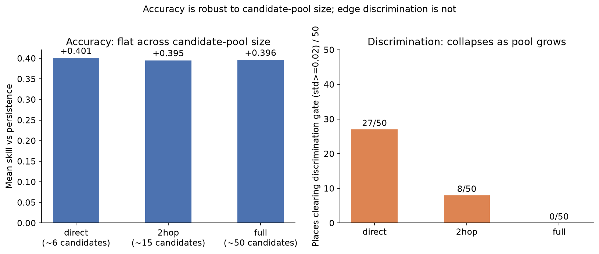
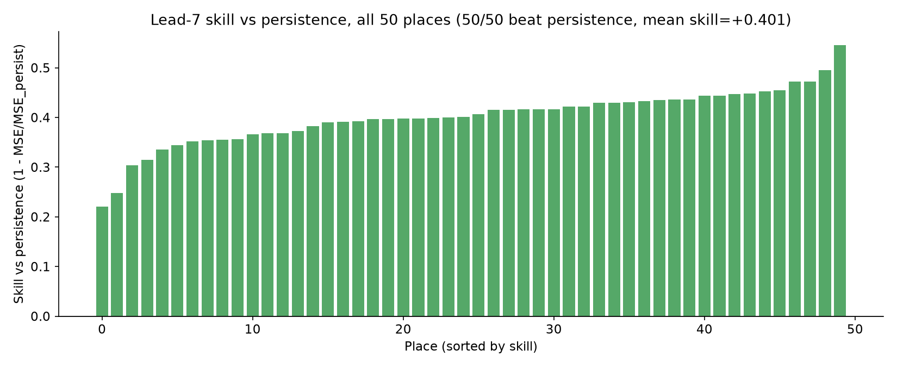
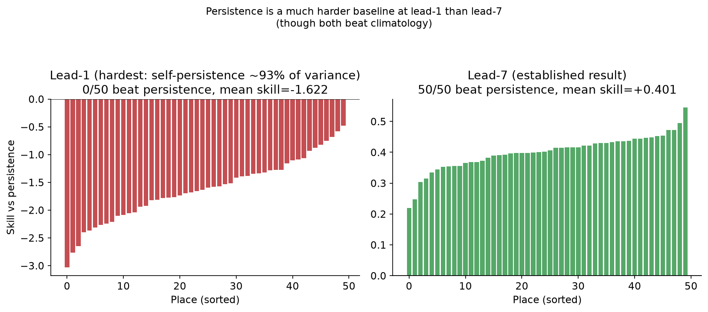
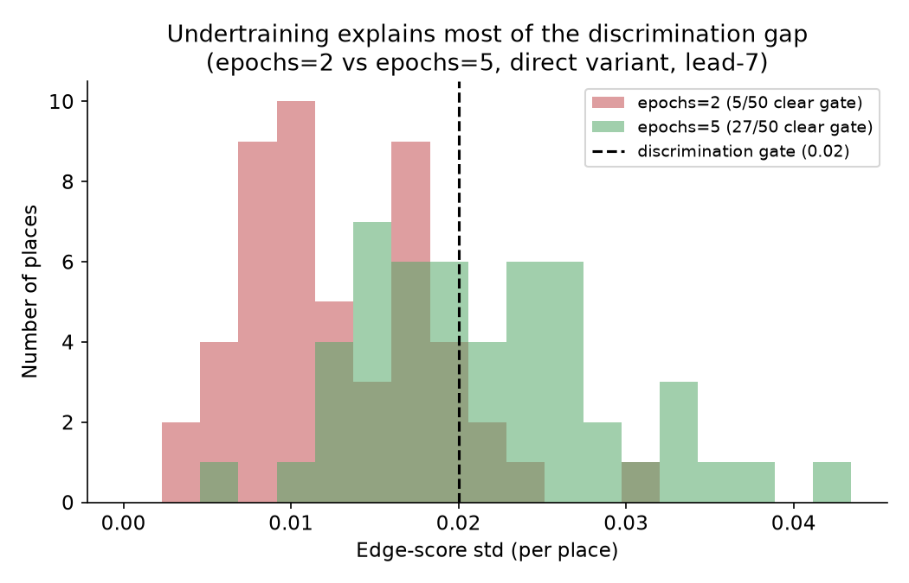
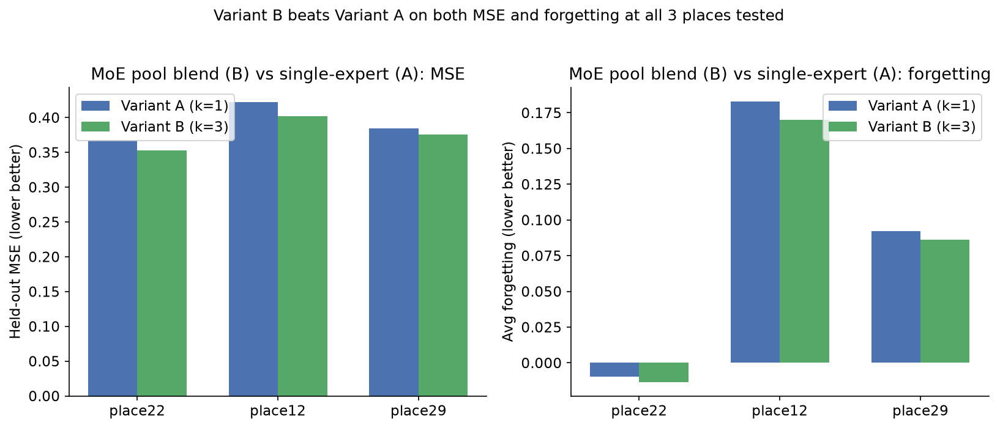

# Causal-MoE for Tropical Intraseasonal Forecasting

A step-by-step guide to what this project builds, how it works, and what
the results actually show. Written for teammates picking this up for the
first time — read top to bottom in order.

---

## 1. The problem, in one paragraph

We have 44 years of daily tropical weather data over the Indo-Pacific
(1979–2022). For 50 regions across that domain, we want to forecast a
signal called OLR (explained in §2) a few days into the future. Beyond
just forecasting, we also want the system to say *which other regions
are actually driving* a given region's future weather — not just which
ones are statistically correlated with it, but which ones look like a
genuine physical cause. That second part is the hard, interesting part of
the project, and it's what most of this document explains.

**Two ideas make this project different from a standard forecasting
model:**

1. **The model explains itself before it forecasts.** For a target
   region, a sub-model first looks at candidate "source" regions and
   scores each one for how causally relevant it looks. Only the
   top-scoring sources are then used to make the forecast. This part is
   called the **causal splitter**.
2. **The model adapts when the physics changes.** Weather regimes shift
   over time (El Niño years behave differently from normal years). Instead
   of one frozen model per region forever, each region keeps a *lineage*
   of models over time, and the system can retrain, spawn a fresh model,
   or bring back an old one when it detects the underlying relationships
   have changed. This part is called the **Mixture-of-Experts (MoE)**
   layer.

The project's name, **Causal-MoE**, is these two ideas wired together:
causal structure change is what decides when the expert layer retrains,
spawns, or reactivates — instead of retraining on a fixed schedule.

**Where the project currently stands, in one line:** the forecasting half
works well and beats a simple baseline at every one of the 50 regions at
a 7-day forecast horizon; the causal-discovery half reliably tells real
drivers from noise when it only has to consider a region's *immediate
neighbours*, and that reliability drops as the number of candidate
regions it has to consider grows larger.

---

## 2. The data

### 2.1 What we actually have

**Source:** BSISO (Boreal Summer Intraseasonal Oscillation) monitoring
data. BSISO is a slow-moving pattern of tropical convection — clouds and
rain building up and dying down over roughly a 30–60 day cycle — in the
same family as the more famous MJO (Madden-Julian Oscillation).

**Grid:** 25 latitude points × 144 longitude points = 3,600 grid cells,
covering the Indo-Pacific at 2.5° resolution (roughly 275 km per cell).

**Time:** one value per day, from 1979-01-01 to 2022-12-31 — 16,071 days,
with zero missing days.

**Six physical fields, measured at every grid cell, every day:**

| field | meaning | how predictable it is (autocorrelation at 10 days) |
|---|---|---|
| sst | sea surface temperature | high (0.36) — easiest |
| h850 | mid-level geopotential height | low (0.01) |
| u200 | upper-level jet wind | low (0.05) |
| pw | column water vapour | low (0.03) |
| u850 | low-level monsoon wind | low (0.01) |
| **olr** | outgoing longwave radiation | **lowest (0.01) — hardest** |

**Autocorrelation, explained with an example:** autocorrelation at 10
days asks "if I know today's value, how well does that predict the value
10 days from now?" SST's 0.36 means today's sea temperature still tells
you something useful about the sea temperature 10 days later — the ocean
changes slowly. OLR's 0.01 means today's OLR tells you almost nothing
about OLR 10 days later — cloud cover changes fast and unpredictably at
that range. This is exactly why OLR is chosen as the forecast target: a
model that could just "predict tomorrow = today" would score badly on
OLR, so any real skill the model shows on OLR has to come from
somewhere else.

### 2.2 Why OLR, and what a forecast of it actually means

OLR (outgoing longwave radiation) is a standard proxy for rainfall/cloud
cover: **low OLR = cold, high cloud tops = active rain; high OLR = clear
skies = suppressed rain.** The model never sees rainfall numbers directly
and is never trained on rainfall labels. It forecasts OLR, and a
forecasted drop in OLR is *interpreted* as "rain is intensifying," because
that physical relationship is well established in meteorology. So the
accurate description of this project is "OLR-based rainfall/convection
forecasting," not "rainfall prediction" — a small but important
distinction.

### 2.3 What was already done to the data before we got it

Every field arrives already **anomaly-processed**: the normal seasonal
cycle for that exact location and time of year has been subtracted out,
and the result has been normalized (per grid cell — verified directly,
not one global number for the whole map). So a value of, say, +1.5 in the
OLR field doesn't mean "OLR is 1.5 units" — it means "OLR today at this
exact spot is 1.5 standard deviations *above what's normal for this spot
at this time of year*." This matters because it's what lets the model
compare cold-weather regions and warm-weather regions on the same scale.

### 2.4 A scope note worth knowing

BSISO, by definition, only exists as a coherent pattern during the boreal
summer (roughly May–October). This project trains and evaluates using
the full 12-month record rather than restricting to that season. We
tested directly whether this mattered — retraining one region using only
May–October data and comparing against the year-round result — and found
no meaningful difference either way. So "BSISO" throughout this document
should be read as shorthand for "the kind of tropical intraseasonal
weather variability this dataset captures across the whole year," not a
claim that training was restricted to the BSISO season specifically.

---

## 3. Step 1: From 3,600 grid cells to 50 regions

Running a model over 3,600 individual grid cells directly is both
computationally impractical and not very meaningful — a single 2.5°×2.5°
cell is an arbitrary unit, not a physically natural one. So the first
processing step groups nearby, similarly-behaving cells into **50
regions** ("places").

**How the grouping works:** k-means clustering on each cell's OLR
behaviour over time. Cells whose OLR rises and falls together end up in
the same group, regardless of the group's exact shape on the map. In
practice this produces mostly sensible, geographically compact regions —
46 of the 50 clusters come out as single contiguous blobs, not scattered
patches — because nearby cells usually do behave similarly anyway.

```
   3,600 raw grid cells (25 lat x 144 lon)
                 |
      [k-means grouping by OLR correlation, fit on the training span]
                 |
                 v
   50 regions ("places"), each = the average of ~72 member cells
                 |
   [physical adjacency: which regions touch on the map, longitude wraps around]
                 |
                 v
      50-node graph mesh  <-- this is the "place" the rest
                                of the system operates on
```

**A concrete example of what a "region" is:** region 22 in this project
(used throughout the examples below) sits over the equatorial Maritime
Continent (roughly Sumatra/Indonesia) — a real location that turns out to
be one of the more informative regions to study, because it sits at the
crossroads of several monsoon circulation patterns.

**One deliberate design choice worth understanding:** *how the 50 regions
were formed* (grouping by OLR correlation) and *which regions are allowed
to be "candidate causes" of which other regions* (§5 below) use two
different, independent rules. The second rule is pure geography — "is
this region physically touching that region on the map" — with no
correlation involved at all. Keeping these two steps independent guards
against a subtle trap: if you grouped regions by correlation and *then*
tested for "causal" relationships using that same correlation
information, you could end up rediscovering the grouping algorithm's own
pattern-matching rather than a genuine physical relationship. We checked
this isn't happening in practice — the strongest real "causal" pair found
in this project (region 22's top matched source) has a correlation of
0.34, a moderate, ordinary teleconnection strength, not the near-1.0
value you'd expect if two regions were secretly near-duplicates of each
other.

---

## 4. Step 2: What each region "knows" about itself

For every region, on every day, the model is given a feature vector — a
list of numbers describing that region's recent state.

**Each region's feature vector, per day:**

```
one region's node vector, per day
┌───────────────────────────────────────────────────────────┐
│  6 fields (sst, h850, u200, pw, u850, olr)                  │
│    x 7 time lags (today, 1, 2, 3, 5, 7, and 10 days ago)      │
│    + is_ocean flag (fraction of the region that's ocean)       │
│  = 49 numbers, one region, one day                             │
└───────────────────────────────────────────────────────────┘
```

**Why several time lags, not just "today"?** A causal relationship
between two regions is very often a *delayed* one — region B's weather 5
days ago might be what's currently shaping region A's weather, not
region B's weather right now. If the model only ever saw "today," it
would be structurally unable to notice a 5-day-delayed relationship no
matter how strong it is in the real data — the information simply
wouldn't be there to find. Giving the model several lagged snapshots
(today, 1, 2, 3, 5, 7, and 10 days back) means a delayed relationship at
any of those specific lags is at least representable.

**Example, concretely:** suppose region B's convection genuinely
influences region A's rainfall, but the atmospheric transport takes about
5 days. If the model only saw "region B today," it would see this
relationship as noise, because "region B today" has nothing to do with
"region A's rainfall today." But because the model also sees "region B,
5 days ago" as a separate number in its feature vector, that specific
lagged signal is available for the splitter to potentially notice and
select.

---

## 5. Step 3: Which regions are even allowed to be candidates?

Before the model tries to find causal drivers, it needs a **candidate
pool** — a list of "other regions that are even allowed to be considered
as possible drivers" for a given target region. Three different pool
definitions are used and compared:

| variant | candidate pool | typical size, example (region 22) |
|---|---|---|
| `direct` | the target's immediate physical neighbours (+ itself) | ~6–8 regions |
| `2hop` | neighbours, plus neighbours-of-neighbours (+ itself) | ~15–23 regions |
| `full` | literally all other 49 regions (+ itself) | 50 regions |

**A concrete example:** for region 22, the `direct` pool might be
something like `{1, 6, 10, 12, 22, 27, 34, 48}` — region 22 itself plus
the handful of regions that are physically adjacent to it on the map.
The `full` pool for the same region is simply "all 50," including
regions on the opposite side of the domain that have no obvious
geographic relationship to region 22 at all.

**Why try all three, instead of picking one?** Real teleconnections in
the atmosphere aren't guaranteed to be local — a driver could genuinely
be far away, not just next door. `direct` is the "safe, local" pool;
`full` is the "cast the widest possible net" pool; `2hop` is a middle
ground. The project tests all three specifically to see whether widening
the net finds anything a narrower search would miss — and to see what
the cost of widening it is. (Spoiler, covered fully in §7: the cost is
real, and it's a discrimination-quality cost, not an accuracy cost.)

---

## 6. Step 4: The causal splitter — how it decides what's real

This is the core mechanism, and the part with no simple ground-truth
answer to check against.

### 6.1 Why there's no simple ground truth

For a normal machine learning task, you'd have labeled examples: "this
photo is a cat" — a fact a human confirmed. For real climate data, nobody
has ever *directly observed* "region 27 causally drives region 22's OLR
at a 7-day lag" the way you'd confirm a photo label. All we ever get to
observe is correlated, lagged patterns in the data — the true underlying
physical mechanism is never handed to us directly.

**So instead, the project checks the mechanism three separate, each
individually weaker, ways:**

1. **Does keeping this edge improve genuinely unseen forecast accuracy?**
   Real evidence, but not proof of causation — a spurious correlation can
   improve a forecast just as well as a genuine cause can.
2. **Does an independent, differently-built method agree?** A separate
   statistical causal-discovery algorithm (PCMCI) is run on the same
   data. If it tends to agree with our model on which sources matter,
   that's supporting evidence — two different guessing methods agreeing
   is more reassuring than one method agreeing with itself, but it's
   still not proof.
3. **On fabricated data where we know the true answer, does the splitter
   find it?** A synthetic test: we build fake data where *we* inject a
   known rule — for example, "region A's future value = 0.6 × region B's
   past value + 0.4 × region C's past value" — hidden inside data that
   otherwise looks like the real climate fields. Since we wrote the rule,
   we know the correct answer, and can check whether the splitter finds
   exactly B and C and ignores everything else. This is real ground
   truth, but only for the fake data — it tells us "does the mechanism
   work in principle," not "did it find the real atmosphere's actual
   causal graph."

### 6.2 The actual mechanism: scoring and swapping

For a target region, the splitter's "Rationale Generator" scores every
candidate edge for how causally relevant it looks. The top-scoring
fraction becomes the **causal set**; the rest becomes the **non-causal
set**.

**The key trick — how it tells "genuinely causal" apart from "just
correlated":**

- Take several *other* days from the same region's history.
- For the current day's prediction, swap out the "non-causal" information
  for the "non-causal" information from one of those other days, while
  keeping the "causal" part exactly as it is today.
- Make the prediction again with this swapped-in version, and see how
  much the resulting error changes.
- **If an edge is genuinely causal**, the prediction shouldn't depend
  much on the irrelevant swapped-in part — the error should barely move
  across different swaps.
- **If an edge only looked useful because of a spurious correlation**,
  swapping breaks whatever coincidence was making it work, and the error
  jumps around a lot across different swaps.

```
one region, one day
        |
        v
[ Rationale Generator ] --- scores every candidate edge
        |
   splits into:
        |
   +----+----------------+
   |                      |
[causal edges c̃]    [non-causal edges s̃]
   |                      |
   |                [swap for a different
   |                 day's non-causal edges]
   |                      |
   +----------+-----------+
              v
       [ Shared Encoder ]
              |
      +-------+--------+
      v                v
[Causal Classifier] [Spurious Classifier]
 (real prediction,   (leakage check only,
  gradients flow)     gradient-blocked)
      |
      v
Loss = average error across swaps
       + λ · variance across swaps
```

**What actually gets trained on:** the loss function has two parts added
together — the average prediction error (be accurate), plus how much
that error *varies* across the different swapped versions (be stable
under the swap test). A relationship can only satisfy both parts at once
if it's genuinely invariant to the irrelevant background changing — which
is what a real causal relationship should look like, and what a merely
correlated one typically won't.

**A design detail worth knowing:** the target region's own past OLR
(self-persistence) is treated as just another candidate edge — it can be
*selected* by the splitter like any other source, but it is not
automatically force-fed into the forecast regardless of what gets
selected. This matters because self-persistence alone is an extremely
strong predictor at short lags (a region's OLR today is a very good
guess at OLR tomorrow) — if it were force-fed unconditionally, the model
could get a good forecast while completely ignoring whatever the splitter
selected, which would make the whole causal-discovery mechanism
pointless. Keeping self as a selectable-but-not-mandatory option is what
keeps the swap-test signal meaningful.

---

## 7. Step 5: The forecaster (the "expert")

Once the splitter has picked a causal set `c̃` for a region, a separate,
smaller model — called `PlaceExpert` — takes those selected source
regions and forecasts the target region's OLR N days ahead.

```
causal edge set c̃ (from the splitter)
        |
        v
┌────────────────────────────┐
│  PlaceExpert                 │
│  weighted-mean aggregation    │
│  over c̃'s source regions      │
│  -> small neural network       │
│  -> forecast                  │
└────────────────────────────┘
        |
        v
  OLR forecast, N days ahead, for THIS region only
```

**Why a separate model from the splitter, rather than one combined
model?** Keeping them separate means the causal-discovery logic and the
forecasting logic can each be improved, frozen, or replaced independently
— you could swap in a better forecaster later without having to redesign
how causal edges are found, and vice versa.

---

## 8. Results — candidate-pool size and causal-discrimination quality

This is one of the most important, and most nuanced, findings in the
project: **forecast accuracy and "trustworthy causal discovery" are two
different things, and they don't move together.**



**Reading this chart:** the left panel shows forecast skill (how much
better than the naive baseline the model does) for each of the three
candidate-pool variants — it's essentially flat, ~0.40 regardless of pool
size. The right panel shows how many of the 50 regions produce a
*genuinely discriminating* set of edge scores (not just noise clustered
around one value) — and that number collapses hard as the pool grows:
27 of 50 regions for `direct`, down to 8 for `2hop`, down to 0 for `full`.

**Why this happens:** the splitter has one shared internal model that has
to score every candidate in the pool in a single pass. A small, fixed,
consistent pool (like `direct`'s handful of physical neighbours, the same
shape every time) is a much easier discrimination task than a pool of 50
similar-looking competing hypotheses all at once. It's a capacity
problem, not a training-time problem — training longer helps somewhat,
but doesn't fully close the gap once the pool is large.

**Practical consequence for anyone using this project's output:** if you
want to make a claim like "region X causally drives region Y," only
trust that claim when it comes from the `direct` variant. `2hop` and
`full` still forecast just as accurately, but their selected edges should
be treated as accuracy-only results, not reliable causal claims.

---

## 9. Results — forecast accuracy across all 50 regions



At a **7-day forecast horizon**, the model beats a naive "tomorrow =
today" baseline at **every single one of the 50 regions**, with skill
ranging from +0.22 to +0.55 (mean +0.40) — meaning the model's prediction
error is, on average, about 40% lower than just guessing that nothing
changes from today.

### Why the forecast horizon (lead time) matters so much



At a **1-day** forecast horizon, the picture flips completely: the model
beats the naive baseline at **0 of 50 regions**. This is not a failure of
the model — it's because at 1 day ahead, "today's value" is already such
an extremely strong predictor (weather barely changes day to day) that
essentially nothing can beat it. The honest way to read this: the naive
baseline is a genuinely very hard bar at 1 day, and a much easier bar at
7 days, and the model's relative performance against it should always be
read together with which lead time is being discussed.

**A separate baseline, for context:** the model is also compared against
"climatology" — simply predicting the long-term average value every day,
ignoring today's conditions entirely. At the 1-day horizon, the model
clearly beats climatology (mean R² = +0.73) even though it can't beat the
much harder persistence baseline there. At the 7-day horizon, the picture
is more mixed against climatology specifically (mean R² is close to
zero, and about 6 in 10 regions individually score slightly below it) —
while still cleanly beating persistence. **These are genuinely two
different comparisons, and both should be reported together, not just
the flattering one:** "beats persistence" is true and solidly established
at 7 days; "beats climatology" is a separate, much closer contest at that
same horizon.

### Training budget matters too



The discrimination-quality numbers above (§8) were measured after
training each region for 5 epochs. Training for only 2 epochs — half the
budget — cuts the number of regions clearing the discrimination-quality
bar roughly in half (from 27/50 down to 5/50), while forecast accuracy
barely changes. This is a useful, practical lesson: if you're evaluating
whether the causal-discovery mechanism is "working," make sure the model
was actually trained long enough first — an undertrained run can look
like a broken mechanism when it's really just undertrained.

---

## 10. Step 6: Adapting when the physics changes (Mixture-of-Experts)

Weather regimes shift over time. A relationship that held for years can
break down (an El Niño year behaves differently from a normal year), and
a model trained once and never updated will quietly get worse at exactly
the moments it matters most. This project addresses that with a
per-region model *lineage*, plus a way to detect when the lineage needs
to change.

### 10.1 Detecting that something has changed

Two independent "channels" watch for drift, and their signals are
combined:

```
┌──────────────────────────┐      ┌──────────────────────────────┐
│ Channel 1 — error-based    │      │ Channel 2 — causal-structure   │
│                              │      │ based                            │
│ Watches the expert's        │      │ Watches whether the PATTERN of  │
│ rolling forecast error       │      │ which edges the splitter scores │
│ for a sudden jump             │      │ highly is itself changing over  │
│                              │      │ time                             │
└──────────────┬───────────────┘      └───────────────┬──────────────┘
               │                                        │
               └───────────────┬────────────────────────┘
                                v
                    ┌───────────────────────┐
                    │  Combine the two          │
                    │  OR  --  react fast, more  │
                    │          false alarms       │
                    │  AND --  react slow, fewer   │
                    │          false alarms         │
                    └───────────┬───────────┘
                                v
              ┌─────────────────────────────────┐
              │  Decision                           │
              │  Tier 0: nothing has changed,       │
              │          keep the current expert     │
              │  Tier 1: retrain the current expert  │
              │          on recent data              │
              │  Tier 2: archive the current expert   │
              │          and bring in a new/different │
              │          one                          │
              └─────────────────────────────────┘
```

**Why watch causal structure, and not just forecast error?** Forecast
error only tells you something is wrong *after* the model starts getting
worse. Watching the causal edge scores' own pattern can, in principle,
catch a genuine underlying shift in the physics *before* it necessarily
shows up as a worse forecast — a more forward-looking signal.

**Concrete example of the trade-off, measured on real test cases (an
abrupt shift — the 1997-98 El Niño — and a gradual, multi-year shift):**

| detector | catches the abrupt shift? | catches the gradual shift? |
|---|---|---|
| Error-based only | missed it | yes, but slowly |
| Causal-structure only | yes, quickly | yes |
| Combined with OR (either triggers) | yes, quickly | yes |
| Combined with AND (both must agree) | missed it | yes, but slowly |

This is a genuine trade-off, not a solved problem: reacting fast (OR)
means more false alarms; being conservative (AND) means missing some
real, fast-moving shifts. The project reports both rather than picking
one as "correct."

### 10.2 Archiving old experts and bringing them back

Instead of deleting an old expert the moment a new one is needed, retired
experts are archived. Since weather regimes recur (seasons, El Niño/La
Niña cycles), an old archived expert might be exactly the right fit again
later.

```
Region A:  Expert A-1 --[drift]--> Expert A-2 --[drift]--> Expert A-3 (ACTIVE)
                |                        |
          [hibernate]              [hibernate]
                v                        v
             Archive A  <---- searched on every future drift event
```

### 10.3 Single best match vs. blending several — a real, tested comparison

When a drift event fires and the system needs to bring in a replacement
expert, there are two ways to use the archive:

```
   drift event fires for Region A
              |
              v
   compute Region A's current "causal signature"
   (a summary of which edges it's currently scoring highly)
              |
              v
   compare against EVERY archived signature in the whole system
              |
       +------+---------------------+
       |                            |
  Variant A                    Variant B
  use the SINGLE best-           BLEND the top-3 best
  matching archived expert       matches together, weighted
                                  by how similar each one is
```



**Result, tested at three different regions:** blending the top-3
matching archived experts (Variant B) beats using just the single
best-matching one (Variant A) on both forecast accuracy *and* "forgetting"
(how much worse the system does on a regime it's seen before, the second
time it recurs) — consistently, at every region tested. This is one of
the most solidly repeated findings in the whole project.

---

## 11. Putting it all together — the full pipeline

```
raw grid (3,600 cells)
        |
   [clustering] -> 50 regions, physical adjacency mesh
        |
   [windowing] -> 49 lagged features per region, per day
        |
        v
  +-----------------------------------------+
  |  per region, per time block:             |
  |    Splitter -> scores candidate edges     |
  |             -> picks the causal set c̃      |
  |    Expert trained on c̃                     |
  |    -> OLR forecast, N days ahead           |
  +-----------------------------------------+
        |
   [drift detection, two channels] --watches--> forecast error +
        |                                        causal-structure signals
   drift detected? -> retrain in place, or archive + bring in new/blended
        |
   repeated independently across all 50 regions
```

---

## 12. Code map

All code lives under `DIR_GNN + DyMoE/code/`.

```
code/
├── causal_moe/                  the actual library
│   ├── data/
│   │   ├── raw.py               loads the 6 fields + ocean mask
│   │   ├── clustering.py        k-means -> 50 regions
│   │   ├── mesh.py              physical adjacency (raw cells + regions)
│   │   ├── windows.py           49-value lagged features, OLR-N-days target
│   │   ├── splits.py            chronological train/val/test split +
│   │   │                        El Niño / gradual-drift test windows
│   │   ├── candidate_edges.py   direct / 2hop / full candidate-pool variants
│   │   ├── causaldynamics.py    loads validation data with known causal graphs
│   │   └── semisynthetic.py     real features + a hand-injected, known causal
│   │                            rule (the synthetic ground-truth test, §6.1)
│   ├── splitter/
│   │   ├── dirgnn.py            the causal splitter (§6)
│   │   ├── cia.py               an alternative edge-selection mechanism
│   │   └── gsina.py             an alternative edge-selection mechanism
│   ├── experts/
│   │   ├── expert.py            the forecaster (§7)
│   │   └── pool.py              the Mixture-of-Experts blending router (§10.3)
│   ├── drift/
│   │   ├── rodionov.py          the change-point statistical test (§10.1)
│   │   ├── channels.py          both drift channels + how they're combined
│   │   ├── archive.py           the hibernate/reactivate store (§10.2)
│   │   └── forgetting.py        the "how much did we forget" metric
│   └── baselines/simple.py      persistence / plain-GNN / random-subset comparisons
├── scripts/                      one runnable script per experiment
├── tests/                        144 automated tests, all passing
├── cache/                        preprocessed data (regenerable, not stored in git)
└── results/                      every experiment's numeric result, plus
    └── phase9_figures/            the charts embedded in this document
```

**Reference implementations used** (real published code, not
reimplemented from scratch): the causal-splitter mechanics come from
[Wuyxin/DIR-GNN](https://github.com/Wuyxin/DIR-GNN) (Wu et al., ICLR
2022); the independent causal cross-check uses
[tigramite](https://github.com/jakobrunge/tigramite)'s PCMCI algorithm;
the known-ground-truth validation data comes from
[kausable/CausalDynamics](https://github.com/kausable/CausalDynamics).

---

## 13. Current limitations, stated plainly

- **Causal-discrimination reliability depends heavily on candidate-pool
  size** (§8) — trustworthy for `direct`, not for `2hop`/`full`.
- **No independently verified ground truth exists for real climate causal
  relationships** (§6.1) — every causal claim in this project rests on
  the three indirect checks described there, not on a known correct
  answer.
- **Direct comparison against other published Mixture-of-Experts methods
  from the wider research literature has not been done** — only the
  internal comparisons described in this document (persistence,
  plain-GNN, random-subset, CIA, GSINA) are included.
