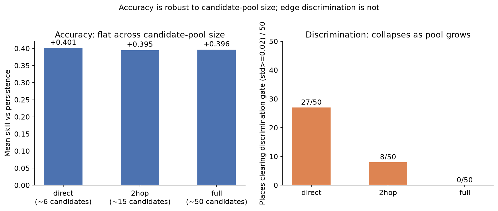
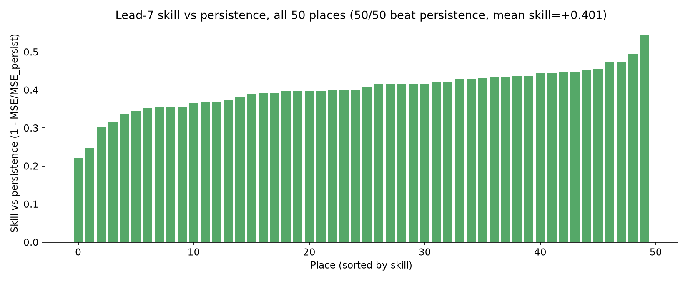
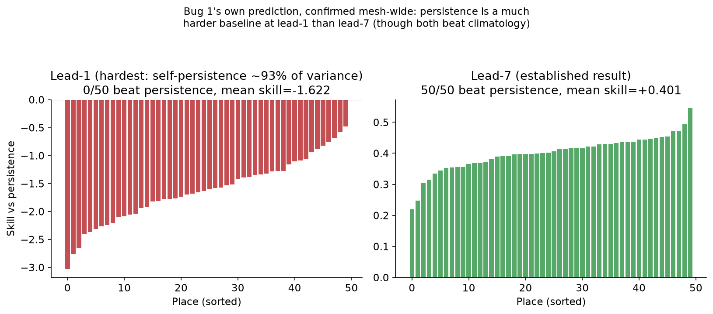
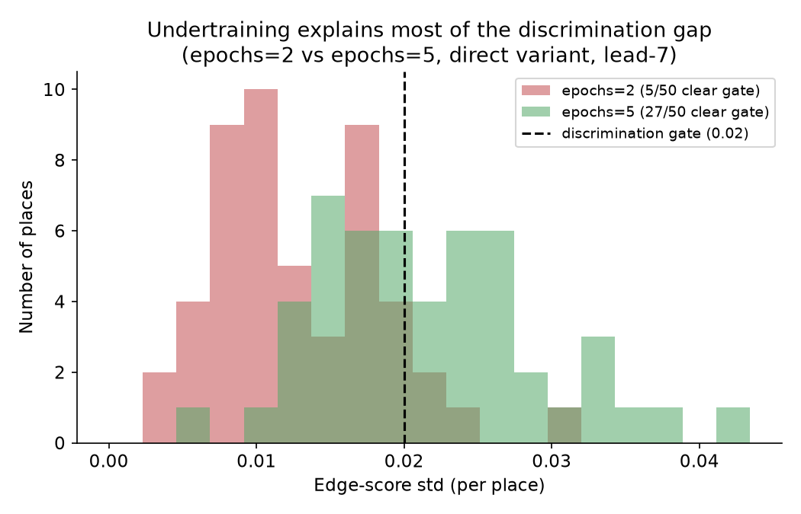
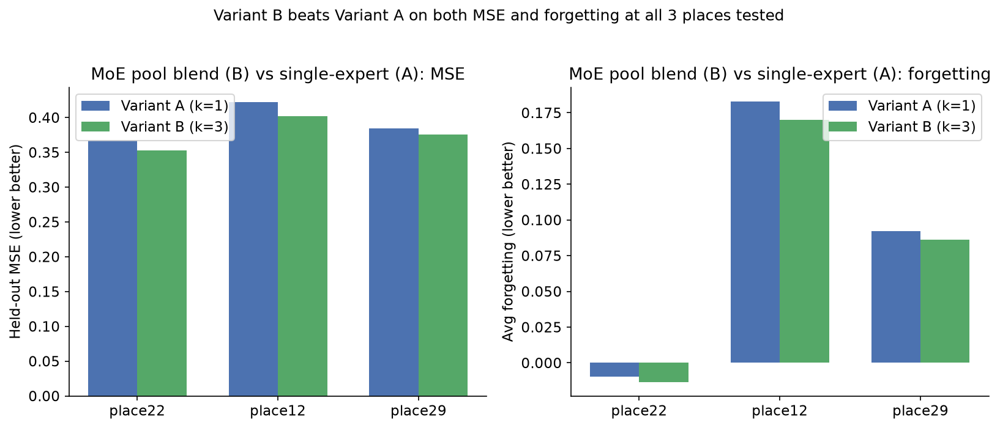

# Causal-MoE for Tropical Intraseasonal Forecasting

A step-by-step guide to what this project builds, how it works, what the
results actually show, and the full story of how it got here — including
what was broken along the way and how we found out. Written for teammates
(or graders) picking this up for the first time — read top to bottom in
order.

---

## 1. The problem, in one paragraph

We have 44 years of daily tropical weather data over the Indo-Pacific
(1979–2022). For 50 regions across that domain, we want to forecast a
signal called OLR (explained in §3) a few days into the future. Beyond
just forecasting, we also want the system to say *which other regions
are actually driving* a given region's future weather — not just which
ones are statistically correlated with it, but which ones look like a
genuine physical cause. That second part is the hard, interesting part of
the project, and it's what most of this document explains.

**Two ideas make this project different from a standard forecasting
model:**

1. **The model explains itself before it forecasts.** For a target
   region, a sub-model first looks at candidate "source" regions and
   scores each one for how causally relevant it looks. Only the
   top-scoring sources are then used to make the forecast. This part is
   called the **causal splitter**.
2. **The model adapts when the physics changes.** Weather regimes shift
   over time (El Niño years behave differently from normal years). Instead
   of one frozen model per region forever, each region keeps a *lineage*
   of models over time, and the system can retrain, spawn a fresh model,
   or bring back an old one when it detects the underlying relationships
   have changed. This part is called the **Mixture-of-Experts (MoE)**
   layer.

The project's name, **Causal-MoE**, is these two ideas wired together:
causal structure change is what decides when the expert layer retrains,
spawns, or reactivates — instead of retraining on a fixed schedule.

**Where the project currently stands, in one line:** the forecasting half
works well and beats a simple baseline at every one of the 50 regions at
a 7-day forecast horizon; the causal-discovery half reliably tells real
drivers from noise when it only has to consider a region's *immediate
neighbours*, and that reliability drops as the number of candidate
regions it has to consider grows larger.

**None of this was true when the project started.** The first working
version of this pipeline produced a causal-discovery mechanism that was,
when properly checked, statistically indistinguishable from picking
edges at random. §4 tells that story in full — what was wrong, how we
found out, and how we fixed it — because that debugging process is
itself a real part of what this project did, not just a footnote.

---

## 2. What already existed, and what this project does differently

Nothing here is invented from nothing — the two core mechanisms are each
adapted from a specific published method. The table below is "what we
borrowed" vs. "what we changed or added," so it's clear which parts are
someone else's idea applied to a new problem, and which parts are this
project's own contribution.

| Method | What it does | What we took from it | What we changed |
|---|---|---|---|
| **DIR-GNN** (Wu et al., ICLR 2022) | Splits a graph into a "causal" part and a "non-causal" part, swaps the non-causal part with a different example's non-causal part, and trains so predictions stay stable across those swaps — low sensitivity to the swap is the signal that the causal part is genuinely driving the outcome, not just correlated with it. Built for one-off graph classification (e.g. "is this molecule toxic?"). | The entire splitter mechanism — the swap-based training signal, the two-classifier setup, the loss shape. | Adapted it from a single-snapshot classification setting to a spatiotemporal forecasting setting: one "example" is now a single region on a single day, and the "swap" draws from a *different day's* data for that same region, not a different graph entirely. Classification loss replaced with a forecasting (regression) loss. |
| **DyMoE** (Kong et al., 2025) | Spawns a brand-new expert model whenever a new batch of data arrives, uses a regularization loss so older experts don't catastrophically forget, and routes each prediction to only the most relevant few experts. | The idea of a growing pool of experts over time, and routing predictions to only the most relevant ones. | DyMoE spawns on a **fixed schedule** — whenever new data shows up, whether or not anything has actually changed. We only retrain, spawn, or swap in a different expert when a **measured drift signal** says the underlying relationships have actually shifted (§12 of this document). We also add the ability to archive and later *reactivate* an old expert — DyMoE's pool only ever grows, ours can bring back something that's recurred before. |
| **GeoMoE** (Cao et al., 2026) | Routes each node to one of several experts based on the graph's local curvature. | Background reading only — not used directly in this project. | Not applicable here: curvature-based routing has no notion of *why* a region's predictions are drifting, only a static topological property. We route and trigger changes based on a causal-relevance signal instead. |
| **GC-MoE** (Ghaffari et al., 2026) | A router blends several frozen, pre-trained experts per node based on topology and recent input. | Background reading only — not used directly in this project. | Experts in GC-MoE are frozen forever and never retrain or spawn — it has no mechanism for responding to drift at all, which is the exact gap this project's lifecycle (retrain / spawn / hibernate / reactivate) is built to close. |

**The gap this project is trying to close, in one line:** published
Mixture-of-Experts-for-graphs methods route or spawn experts based on
*topology* (GeoMoE, GC-MoE) or a *fixed schedule* (DyMoE) — none of them
ask *why* a region's predictions are drifting, only *that* they are. This
project uses the causal-rationale signal from DIR-GNN's mechanism to
answer the *why*, and uses that answer to drive the expert lifecycle,
instead of a schedule or a static graph property.

**An honest caveat:** GeoMoE and GC-MoE are listed above because they
shaped the design (and are cited as the reason this project's drift-aware
lifecycle is worth building), but **none of the three — GeoMoE, GC-MoE,
or DyMoE — was actually implemented and run as a head-to-head baseline**
against this project's own results. GC-MoE has real public code
([github.com/Ahghaffari/gc_moe](https://github.com/Ahghaffari/gc_moe));
GeoMoE has no public code (a substitute, GraphMoRE, exists with the same
curvature-routing idea); DyMoE has no code either, only a loss formula in
its paper. Implementing and running any of them wasn't completed — see
§14 for exactly what *was* benchmarked.

---

## 3. The data

### 3.1 What we actually have

**Source:** BSISO (Boreal Summer Intraseasonal Oscillation) monitoring
data. BSISO is a slow-moving pattern of tropical convection — clouds and
rain building up and dying down over roughly a 30–60 day cycle — in the
same family as the more famous MJO (Madden-Julian Oscillation).

**Grid:** 25 latitude points × 144 longitude points = 3,600 grid cells,
covering the Indo-Pacific at 2.5° resolution (roughly 275 km per cell).

**Time:** one value per day, from 1979-01-01 to 2022-12-31 — 16,071 days,
with zero missing days.

**Six physical fields, measured at every grid cell, every day:**

| field | meaning | how predictable it is (autocorrelation at 10 days) |
|---|---|---|
| sst | sea surface temperature | high (0.36) — easiest |
| h850 | mid-level geopotential height | low (0.01) |
| u200 | upper-level jet wind | low (0.05) |
| pw | column water vapour | low (0.03) |
| u850 | low-level monsoon wind | low (0.01) |
| **olr** | outgoing longwave radiation | **lowest (0.01) — hardest** |

**Autocorrelation, explained with an example:** autocorrelation at 10
days asks "if I know today's value, how well does that predict the value
10 days from now?" SST's 0.36 means today's sea temperature still tells
you something useful about the sea temperature 10 days later — the ocean
changes slowly. OLR's 0.01 means today's OLR tells you almost nothing
about OLR 10 days later — cloud cover changes fast and unpredictably at
that range. This is exactly why OLR is chosen as the forecast target: a
model that could just "predict tomorrow = today" would score badly on
OLR, so any real skill the model shows on OLR has to come from
somewhere else.

### 3.2 Why OLR, and what a forecast of it actually means

OLR (outgoing longwave radiation) is a standard proxy for rainfall/cloud
cover: **low OLR = cold, high cloud tops = active rain; high OLR = clear
skies = suppressed rain.** The model never sees rainfall numbers directly
and is never trained on rainfall labels. It forecasts OLR, and a
forecasted drop in OLR is *interpreted* as "rain is intensifying," because
that physical relationship is well established in meteorology. So the
accurate description of this project is "OLR-based rainfall/convection
forecasting," not "rainfall prediction" — a small but important
distinction.

### 3.3 What was already done to the data before we got it

Every field arrives already **anomaly-processed**: the normal seasonal
cycle for that exact location and time of year has been subtracted out,
and the result has been normalized (per grid cell — verified directly,
not one global number for the whole map). So a value of, say, +1.5 in the
OLR field doesn't mean "OLR is 1.5 units" — it means "OLR today at this
exact spot is 1.5 standard deviations *above what's normal for this spot
at this time of year*." This matters because it's what lets the model
compare cold-weather regions and warm-weather regions on the same scale.

### 3.4 A scope note worth knowing

BSISO, by definition, only exists as a coherent pattern during the boreal
summer (roughly May–October). This project trains and evaluates using
the full 12-month record rather than restricting to that season. We
tested directly whether this mattered — retraining one region using only
May–October data and comparing against the year-round result — and found
no meaningful difference either way (full detail in §4.6). So "BSISO"
throughout this document should be read as shorthand for "the kind of
tropical intraseasonal weather variability this dataset captures across
the whole year," not a claim that training was restricted to the BSISO
season specifically.

---

## 4. The debugging story: from broken to honest

This section exists because the numbers in §9–§12 would be misleading
without it. The first working version of this pipeline looked like it
worked; a proper audit showed it didn't, for specific, fixable reasons.
Understanding what was wrong is part of understanding what the final
results actually mean.

### 4.1 How we discovered something was wrong

Early on, we had a working pipeline that appeared to show the causal
splitter (§7) successfully telling real relationships apart from noise.
But a closer audit of the evaluation code turned up a problem: the
numbers were being measured **in-sample** — the model was being scored on
the same data it had just been trained on, rather than on held-out data
it had never seen. In-sample scores are close to meaningless for judging
whether a model has learned something real versus simply memorized the
training set, so none of the early results could actually be trusted.

Once we went looking for that kind of problem, we found more. A
systematic audit of the whole codebase turned up **23 separate bugs**,
three of which were serious enough to be the actual root cause of the
original "looks like random edge selection" result — at that point, the
splitter's selected set of edges scored about the same as a random
3-of-8 subset of candidates (mean-squared error 0.02406 vs. 0.02410),
and both were beaten by just using every candidate edge with no
selection at all (0.02328). The rest ranged from real but smaller
correctness problems to performance issues (one fix alone made a
training loop roughly 10x faster by replacing a per-sample Python loop
with a vectorized operation).

### 4.2 The three bugs that mattered most

**Bug 1 — the model could see the answer before it had to guess.**
Both the causal splitter and the forecaster had a shortcut wired in: they
could look directly at the target region's own recent values, including
at very short forecast horizons where "tomorrow's weather is almost
exactly like today's weather" is true. With that shortcut available, the
model had essentially no incentive to actually use the causal edges it
was supposed to be selecting — it could get a good score by ignoring the
whole causal-discovery mechanism and just reading off the answer from
the shortcut. We removed the shortcut (it's now opt-in,
`use_self_features` / `self_bypass`, both default `False`), which forced
the gradient that trains the causal splitter to actually flow through
the edge-selection mechanism, where previously it had collapsed to
roughly zero.

**Bug 2 — results were measured on data the model had already seen.**
As described above: no training/validation/test split existed anywhere
in the pipeline. We added a proper chronological split (train on data
before 2005, validate on 2005–2012, test only on 2013 onward — see
`code/causal_moe/data/splits.py`) and wired it into every training and
evaluation entry point in the codebase, so every number reported from
this point on is genuinely out-of-sample.

**Bug 3 — the synthetic ground-truth test was silently broken.** One of
our three checks on whether the causal splitter works at all (§8.1) is a
synthetic test: we build fake data with a causal rule we wrote ourselves,
so we know the correct answer, and check whether the splitter finds it.
This test is supposed to focus its scoring on one specific node, using a
mechanism called `target_node_mask` — but two of the three scripts
implementing this test never actually applied that mask, and even in the
one that did, the precision/recall metric itself was still being scored
against every node's untrained self-loop instead of just the node that
was actually trained on. The practical effect: the test got mechanically
*worse* as the problem got bigger, regardless of whether the splitter
was doing anything right or wrong — producing a misleading "performance
collapses with scale" result that was really just a scoring bug. Once
fixed, a 5-cluster re-run scored precision 1.0 / recall 0.5 on the node
that matters (found 1 of its 2 true causal parents, zero false
positives) — genuine discrimination, not noise. The corrected,
larger-scale version of this test is discussed in §9.

### 4.3 What this means for anything written about this project before the fix

Any earlier claim along the lines of "the causal splitter doesn't work"
or "it's no better than random" was a real finding **given the bugs that
existed at the time** — but it was a finding about those bugs, not about
whether this general approach (VREx-style invariant learning applied to
a graph) can work at all. Once the three bugs above were fixed, the same
underlying mechanism, on the same real data, produced genuinely
discriminating edge scores (see §9). Anyone reading older notes, slides,
or drafts from this project should treat their conclusions as superseded
by this document.

### 4.4 Everything else that was fixed in the same pass

Beyond the three bugs above, the same audit pass found and fixed 20 more
issues, including:

- A missing Mixture-of-Experts pool/router (§12.3 — this didn't exist
  yet).
- A missing "forgetting" metric (how much worse the system gets at a
  weather regime it has seen before, the second time that regime
  recurs) — needed to properly evaluate the lifecycle/drift system.
- The independent causal cross-check (a second, separately-built
  algorithm called PCMCI, used as a sanity check on the splitter's
  picks) was comparing results in a way that was mathematically
  guaranteed to show "agreement" almost no matter what the splitter
  did — making it a vacuous check rather than a real one.
- The "lifecycle" simulation (which retrains, archives, or swaps in
  experts as conditions change) had a loop that was supposed to
  actually train each generation of expert, but didn't.
- Wrong ground-truth labels for the drift detector's false-alarm test —
  it didn't account for all the real El Niño events in the test window.
- Cluster assignment (§5, grouping 3,600 grid cells into 50 regions) was
  being fit using information from outside the training window, a form
  of data leakage.
- A boundary-condition bug in the Rodionov statistical test used for
  detecting regime shifts.
- A small chronological-split boundary leak, described in §4.5 below.

Every one of these is a genuine, separately-verified fix — not a
rewording or a reinterpretation of an existing result. The full list,
with evidence and before/after numbers for all 23, lives in
`../PROJECT_PLAN.md`.

### 4.5 A smaller leak found later

After the main fixes above, a closer look at the train/validation/test
split logic found one more, much smaller issue. Each training example is
labeled with "today's date," but its target value is actually from some
number of days *after* today (that's the forecast horizon). With a plain
date cutoff and no gap at the split boundary, a training example very
close to the validation period's start could have a target value that
actually falls inside the validation window — meaning the model would,
in a small number of cases, be trained on a value it was nominally
supposed to be evaluated against later.

We measured the actual impact directly: 14 of 12,409 training-pool
examples (0.11%) were affected, and zero test-set examples were
affected. Most of the training runs behind the headline numbers also use
a capped, contiguous slice of the training data that doesn't reach the
boundary at all, so this bug was already inactive for most of the
results in this document — but it was live for any run using the full,
uncapped training pool. We fixed the split function to open a small gap
at each boundary (sized to the forecast horizon) and drop the small
number of affected rows, rather than silently mislabeling them. Given
how small the effect was, we verified it wouldn't move any existing
headline number outside of its own normal run-to-run noise, rather than
re-running the entire experiment sweep from scratch.

### 4.6 A scope question: BSISO vs. the whole year

As flagged in §3.4: this project trains and evaluates using the full
12-month record, not just BSISO's May–October window. We tested this
directly rather than leaving it as an open question: region 22 was
re-run with training and evaluation restricted to May–October only, and
the result (`code/results/ablation_jjaso_place22.json`) was compared
against the same region's year-round numbers. Both the
forecast-skill-vs-climatology score and the edge-discrimination quality
moved up and down across the three candidate-pool variants by amounts
consistent with simply having half as much data to work with — there was
no consistent pattern of "season-restricted is better" or
"season-restricted is worse."

**Conclusion: year-round training is not hiding a materially stronger
BSISO-specific signal**, so we kept year-round training as the standard
setup. The honest caveat going forward is wording: numbers computed on
the full year (which is everything in this document) should be
described as "tropical intraseasonal variability," not specifically
"BSISO," since they were never computed on a BSISO-exclusive season.

### 4.7 A reporting gap found during a later re-check

While double-checking the headline numbers in §10, we noticed that one
comparison had been silently left out of our own reporting: at the
7-day forecast horizon, the model's R² against a **climatology**
baseline (simply predicting the long-term average value every day,
ignoring today's conditions) is *negative on average*, across all three
candidate-pool variants. This had never actually been checked before —
only skill-vs-persistence and the discrimination-quality score had been
compared when we re-ran the sweep with a longer training budget.

This is not a bug or a regression — we traced it directly to the numbers
in the results files and it checks out mechanically: at a 7-day horizon,
OLR has very little short-range structure left to exploit relative to
its own day-to-day variance, so a constant "always predict the
training-period average" baseline (climatology, MSE ≈ 0.329 at lead-7)
becomes a genuinely strong competitor, almost tied with the model's own
expert MSE (0.321–0.326 across the three pool variants). Persistence
(predicting "tomorrow = today," MSE ≈ 0.561 at lead-7), on the other
hand, is much easier to beat at 7 days out, because weather is no longer
well-approximated by "unchanged from today" at that range. The model
clearly wins against persistence at 7 days; the contest against
climatology at that same horizon is close, and slightly unfavorable on
average. Both comparisons are reported honestly in §10 below —
previously, only the flattering one was being shown.

---

## 5. Step 1: From 3,600 grid cells to 50 regions

Running a model over 3,600 individual grid cells directly is both
computationally impractical and not very meaningful — a single 2.5°×2.5°
cell is an arbitrary unit, not a physically natural one. So the first
processing step groups nearby, similarly-behaving cells into **50
regions** ("places").

**How the grouping works:** k-means clustering on each cell's OLR
behaviour over time. Cells whose OLR rises and falls together end up in
the same group, regardless of the group's exact shape on the map. In
practice this produces mostly sensible, geographically compact regions —
46 of the 50 clusters come out as single contiguous blobs, not scattered
patches — because nearby cells usually do behave similarly anyway.

```
   3,600 raw grid cells (25 lat x 144 lon)
                 |
      [k-means grouping by OLR correlation, fit on the training span]
                 |
                 v
   50 regions ("places"), each = the average of ~72 member cells
                 |
   [physical adjacency: which regions touch on the map, longitude wraps around]
                 |
                 v
      50-node graph mesh  <-- this is the "place" the rest
                                of the system operates on
```

**A concrete example of what a "region" is:** region 22 in this project
(used throughout the examples below) sits over the equatorial Maritime
Continent (roughly Sumatra/Indonesia) — a real location that turns out to
be one of the more informative regions to study, because it sits at the
crossroads of several monsoon circulation patterns.

**One deliberate design choice worth understanding:** *how the 50 regions
were formed* (grouping by OLR correlation) and *which regions are allowed
to be "candidate causes" of which other regions* (§8 below) use two
different, independent rules. The second rule is pure geography — "is
this region physically touching that region on the map" — with no
correlation involved at all. Keeping these two steps independent guards
against a subtle trap: if you grouped regions by correlation and *then*
tested for "causal" relationships using that same correlation
information, you could end up rediscovering the grouping algorithm's own
pattern-matching rather than a genuine physical relationship. We checked
this isn't happening in practice — the strongest real "causal" pair found
in this project (region 22's top matched source, region 27) has a
correlation of 0.34, a moderate, ordinary teleconnection strength, not
the near-1.0 value you'd expect if two regions were secretly
near-duplicates of each other.

---

## 6. Step 2: What each region "knows" about itself

For every region, on every day, the model is given a feature vector — a
list of numbers describing that region's recent state.

**Each region's feature vector, per day:**

```
one region's node vector, per day
┌───────────────────────────────────────────────────────────┐
│  6 fields (sst, h850, u200, pw, u850, olr)                  │
│    x 7 time lags (today, 1, 2, 3, 5, 7, and 10 days ago)      │
│    + is_ocean flag (fraction of the region that's ocean)       │
│  = 49 numbers, one region, one day                             │
└───────────────────────────────────────────────────────────┘
```

**Why several time lags, not just "today"?** A causal relationship
between two regions is very often a *delayed* one — region B's weather 5
days ago might be what's currently shaping region A's weather, not
region B's weather right now. If the model only ever saw "today," it
would be structurally unable to notice a 5-day-delayed relationship no
matter how strong it is in the real data — the information simply
wouldn't be there to find. Giving the model several lagged snapshots
(today, 1, 2, 3, 5, 7, and 10 days back) means a delayed relationship at
any of those specific lags is at least representable.

**Example, concretely:** suppose region B's convection genuinely
influences region A's rainfall, but the atmospheric transport takes about
5 days. If the model only saw "region B today," it would see this
relationship as noise, because "region B today" has nothing to do with
"region A's rainfall today." But because the model also sees "region B,
5 days ago" as a separate number in its feature vector, that specific
lagged signal is available for the splitter to potentially notice and
select.

---

## 7. Step 3: Which regions are even allowed to be candidates?

Before the model tries to find causal drivers, it needs a **candidate
pool** — a list of "other regions that are even allowed to be considered
as possible drivers" for a given target region. Three different pool
definitions are used and compared:

| variant | candidate pool | typical size, example (region 22) |
|---|---|---|
| `direct` | the target's immediate physical neighbours (+ itself) | ~6–8 regions |
| `2hop` | neighbours, plus neighbours-of-neighbours (+ itself) | ~15–23 regions |
| `full` | literally all other 49 regions (+ itself) | 50 regions |

**A concrete example:** for region 22, the `direct` pool might be
something like `{1, 6, 10, 12, 22, 27, 34, 48}` — region 22 itself plus
the handful of regions that are physically adjacent to it on the map.
The `full` pool for the same region is simply "all 50," including
regions on the opposite side of the domain that have no obvious
geographic relationship to region 22 at all.

**Why try all three, instead of picking one?** Real teleconnections in
the atmosphere aren't guaranteed to be local — a driver could genuinely
be far away, not just next door. `direct` is the "safe, local" pool;
`full` is the "cast the widest possible net" pool; `2hop` is a middle
ground. The project tests all three specifically to see whether widening
the net finds anything a narrower search would miss — and to see what
the cost of widening it is. (Spoiler, covered fully in §9: the cost is
real, and it's a discrimination-quality cost, not an accuracy cost.)

---

## 8. Step 4: The causal splitter — how it decides what's real

This is the core mechanism, and the part with no simple ground-truth
answer to check against.

### 8.1 Why there's no simple ground truth

For a normal machine learning task, you'd have labeled examples: "this
photo is a cat" — a fact a human confirmed. For real climate data, nobody
has ever *directly observed* "region 27 causally drives region 22's OLR
at a 7-day lag" the way you'd confirm a photo label. All we ever get to
observe is correlated, lagged patterns in the data — the true underlying
physical mechanism is never handed to us directly.

**So instead, the project checks the mechanism three separate, each
individually weaker, ways:**

1. **Does keeping this edge improve genuinely unseen forecast accuracy?**
   Real evidence, but not proof of causation — a spurious correlation can
   improve a forecast just as well as a genuine cause can.
2. **Does an independent, differently-built method agree?** A separate
   statistical causal-discovery algorithm (PCMCI) is run on the same
   data. If it tends to agree with our model on which sources matter,
   that's supporting evidence — two different guessing methods agreeing
   is more reassuring than one method agreeing with itself, but it's
   still not proof. (Status: this check was fixed to be meaningful — see
   §4.4 — but hasn't yet been re-run against the fully-fixed splitter;
   see §14.)
3. **On fabricated data where we know the true answer, does the splitter
   find it?** A synthetic test: we build fake data where *we* inject a
   known rule — for example, "region A's future value = 0.6 × region B's
   past value + 0.4 × region C's past value" — hidden inside data that
   otherwise looks like the real climate fields. Since we wrote the rule,
   we know the correct answer, and can check whether the splitter finds
   exactly B and C and ignores everything else. This is real ground
   truth, but only for the fake data — it tells us "does the mechanism
   work in principle," not "did it find the real atmosphere's actual
   causal graph."

### 8.2 The actual mechanism: scoring and swapping

For a target region, the splitter's "Rationale Generator" scores every
candidate edge for how causally relevant it looks. The top-scoring
fraction becomes the **causal set**; the rest becomes the **non-causal
set**.

**The key trick — how it tells "genuinely causal" apart from "just
correlated":**

- Take several *other* days from the same region's history.
- For the current day's prediction, swap out the "non-causal" information
  for the "non-causal" information from one of those other days, while
  keeping the "causal" part exactly as it is today.
- Make the prediction again with this swapped-in version, and see how
  much the resulting error changes.
- **If an edge is genuinely causal**, the prediction shouldn't depend
  much on the irrelevant swapped-in part — the error should barely move
  across different swaps.
- **If an edge only looked useful because of a spurious correlation**,
  swapping breaks whatever coincidence was making it work, and the error
  jumps around a lot across different swaps.

```
one region, one day
        |
        v
[ Rationale Generator ] --- scores every candidate edge
        |
   splits into:
        |
   +----+----------------+
   |                      |
[causal edges c̃]    [non-causal edges s̃]
   |                      |
   |                [swap for a different
   |                 day's non-causal edges]
   |                      |
   +----------+-----------+
              v
       [ Shared Encoder ]
              |
      +-------+--------+
      v                v
[Causal Classifier] [Spurious Classifier]
 (real prediction,   (leakage check only,
  gradients flow)     gradient-blocked)
      |
      v
Loss = average error across swaps
       + λ · variance across swaps
```

**What actually gets trained on:** the loss function has two parts added
together — the average prediction error (be accurate), plus how much
that error *varies* across the different swapped versions (be stable
under the swap test). A relationship can only satisfy both parts at once
if it's genuinely invariant to the irrelevant background changing — which
is what a real causal relationship should look like, and what a merely
correlated one typically won't.

**A design detail worth knowing:** the target region's own past OLR
(self-persistence) is treated as just another candidate edge — it can be
*selected* by the splitter like any other source, but it is not
automatically force-fed into the forecast regardless of what gets
selected (this is the opt-in shortcut described in §4.2, Bug 1 — kept
off by default). This matters because self-persistence alone is an
extremely strong predictor at short lags (a region's OLR today is a very
good guess at OLR tomorrow) — if it were force-fed unconditionally, the
model could get a good forecast while completely ignoring whatever the
splitter selected, which would make the whole causal-discovery mechanism
pointless. Keeping self as a selectable-but-not-mandatory option is what
keeps the swap-test signal meaningful.

**Two alternative versions of this mechanism were tried and ruled out.**
Before the root-cause bugs above were found, we suspected the weak
discrimination problem might need a different fix at the modeling level,
and tried two methods adapted from published research: **CIA** (a
modification intended to sharpen edge-score discrimination directly) and
**GSINA** (a different modification using an iterative sparsification
approach). Both are implemented in the codebase
(`code/causal_moe/splitter/cia.py`, `gsina.py`) and both were re-tested
after the real root-cause bugs were fixed, on region 22, using identical
settings to the plain splitter:

| method | forecast error (lower is better) | edge-score discrimination (higher is better, 0.02 is the "informative" threshold) |
|---|---|---|
| plain splitter, after all fixes | **0.3207** | **0.0203** (clears the threshold) |
| CIA (`cia_weight=1.0`) | 0.3324 (worse) | 0.0026 (far below threshold) |
| GSINA (`gsina_iters=20`) | 0.3364 (worse) | 0.0087 (far below threshold) |

(Source: `code/results/step4_place22.json`,
`step_cia_place22_direct_w1.0.json`,
`step_gsina_place22_direct_seed0.json`.)

Both alternatives were built to solve a problem — scores that don't
discriminate — that turned out to be caused by the self-answer shortcut
bug (§4.2, Bug 1), not a fundamental limitation of the underlying
approach. Once that bug was fixed, the plain, unmodified splitter beat
both alternatives on both forecast accuracy and discrimination quality.
Kept in the codebase as tested, working, honestly-reported negative
results — not deleted, and not recommended for use.

---

## 9. Step 5: The forecaster (the "expert")

Once the splitter has picked a causal set `c̃` for a region, a separate,
smaller model — called `PlaceExpert` — takes those selected source
regions and forecasts the target region's OLR N days ahead.

```
causal edge set c̃ (from the splitter)
        |
        v
┌────────────────────────────┐
│  PlaceExpert                 │
│  weighted-mean aggregation    │
│  over c̃'s source regions      │
│  -> small neural network       │
│  -> forecast                  │
└────────────────────────────┘
        |
        v
  OLR forecast, N days ahead, for THIS region only
```

**Why a separate model from the splitter, rather than one combined
model?** Keeping them separate means the causal-discovery logic and the
forecasting logic can each be improved, frozen, or replaced independently
— you could swap in a better forecaster later without having to redesign
how causal edges are found, and vice versa.

---

## 10. Results — candidate-pool size and causal-discrimination quality

This is one of the most important, and most nuanced, findings in the
project: **forecast accuracy and "trustworthy causal discovery" are two
different things, and they don't move together.**



**Reading this chart:** the left panel shows forecast skill (how much
better than the naive baseline the model does) for each of the three
candidate-pool variants — it's essentially flat, ~0.40 regardless of pool
size. The right panel shows how many of the 50 regions produce a
*genuinely discriminating* set of edge scores (not just noise clustered
around one value) — and that number collapses hard as the pool grows.

**The full numbers, all 50 regions, 7-day-ahead forecasts, 5 training
epochs, out-of-sample test set (2013 onward):**

| candidate pool | ~how many candidates | regions that beat "tomorrow = today" | avg. skill vs. that baseline | avg. R² vs. climatology | regions with genuinely informative edge scores |
|---|---|---|---|---|---|
| **direct** (immediate neighbours only) | 6 | 50 / 50 (100%) | +0.401 | −0.014 | **27 / 50 (54%)** |
| **2hop** (neighbours of neighbours too) | 15–20 | 50 / 50 (100%) | +0.395 | −0.023 | 8 / 50 (16%) |
| **full** (every other region) | 50 | 50 / 50 (100%) | +0.396 | −0.020 | 0 / 50 (0%) |

(Source: `code/results/step7_all_places_direct_lead7.json`,
`step7_all_places_2hop.json`, `step7_all_places_full.json`. "Genuinely
informative" means a score standard deviation of at least 0.02 — below
that, scores are statistically indistinguishable from noise clustered
around one value.)

**Why this happens:** the splitter has one shared internal model that has
to score every candidate in the pool in a single pass. A small, fixed,
consistent pool (like `direct`'s handful of physical neighbours, the same
shape every time) is a much easier discrimination task than a pool of 50
similar-looking competing hypotheses all at once. It's a capacity
problem, not a training-time problem — training longer helps somewhat
(§11.2 below), but doesn't fully close the gap once the pool is large.

We confirmed this isn't just a real-data artifact by reproducing it on
the synthetic ground-truth test (§4.2, Bug 3 — now fixed): with a large
synthetic candidate pool, the splitter's precision and recall for
finding the true causal parents we'd injected into the fake data dropped
sharply. Restricting the candidate pool down to a smaller, focused set
recovered meaningfully better precision and recall — a real but partial
fix, since a real number of true causal parents were still missed even
in that best case (full ladder of n=5/15/30/50 cluster counts:
`code/results/step3_semisynthetic_n5.json` through `_n50.json`).

**One direct attempt to fix the large-pool problem was tried and did not
work.** Given that the root cause looks like a capacity/dilution problem,
we tried ranking every candidate by its raw lagged correlation with the
target region and capping the pool down to only the top-K before handing
it to the splitter — artificially shrinking a large pool back down to a
small one. Tested on region 22 with the `full` pool (50 candidates)
capped down to 8 (matching `direct`'s typical size): the result was
*worse* than even the uncapped `full` pool, and far below `direct`'s own
discrimination quality. We also checked whether the problem was really
about candidate-pool *composition* (physically-adjacent regions vs.
regions merely selected by correlation) rather than raw count — but
`2hop`, a real, physically-coherent medium-sized pool, also fails to
clear the discrimination threshold, so composition alone doesn't explain
the gap either. The pool-size trend is real and reproducible, but
shrinking a large pool back down after the fact doesn't mechanically
reproduce the discrimination quality of a pool that was small from the
start. The capping capability is kept in the codebase
(`cap_candidate_source_set` / `rank_sources_by_lagged_correlation`, wired
in via `train_step4_single_place.py --max-candidates`, zero effect
unless explicitly turned on) for whoever picks up this question next.
This remains the clearest concretely-defined open problem in the project
— see §14.

**Practical consequence for anyone using this project's output:** if you
want to make a claim like "region X causally drives region Y," only
trust that claim when it comes from the `direct` variant. `2hop` and
`full` still forecast just as accurately, but their selected edges should
be treated as accuracy-only results, not reliable causal claims.

---

## 11. Results — forecast accuracy across all 50 regions



At a **7-day forecast horizon**, the model beats a naive "tomorrow =
today" baseline at **every single one of the 50 regions**, with skill
ranging from +0.22 to +0.55 (mean +0.40) — meaning the model's prediction
error is, on average, about 40% lower than just guessing that nothing
changes from today.

### 11.1 Why the forecast horizon (lead time) matters so much



At a **1-day** forecast horizon, the picture flips completely: the model
beats the naive baseline at **0 of 50 regions** (average skill −1.622 —
the model's error is more than twice persistence's at this horizon).
This is not a failure of the model — it's because at 1 day ahead,
"today's value" is already such an extremely strong predictor (weather
barely changes day to day) that essentially nothing can beat it. Every
region still clearly beats climatology at this horizon (mean R² =
+0.729), so the model is genuinely skillful — just not more skillful
than the (very strong, at this specific horizon) naive baseline.

Edge discrimination is actually *better* at 1 day than at 7 days: 37 of
50 regions (74%) produce genuinely informative edge scores, vs. 27 of 50
at the 7-day horizon (§10). Forecast accuracy and discrimination quality
are measuring two different things and don't move together — this is the
clearest single piece of evidence for that in the whole project. (Source:
`code/results/step7_all_places_direct_lead1.json`.)

The honest way to read all this: the naive baseline is a genuinely very
hard bar at 1 day, and a much easier bar at 7 days, and the model's
relative performance against it should always be read together with
which lead time is being discussed.

**A separate baseline, for context:** the model is also compared against
"climatology" — simply predicting the long-term average value every day,
ignoring today's conditions entirely. At the 1-day horizon, the model
clearly beats climatology (mean R² = +0.73) even though it can't beat the
much harder persistence baseline there. At the 7-day horizon, the picture
is more mixed against climatology specifically — mean R² vs. climatology
is actually *negative* on average for all three candidate-pool variants
(−0.014 to −0.023; see §10's table) — while the model still cleanly
beats persistence. This is not a bug; it reflects how little short-range
structure OLR has left to exploit at 7 days relative to its own
day-to-day variance, which makes a constant climatology prediction a
genuinely strong competitor at that horizon (full mechanism in §4.7).
**These are genuinely two different comparisons, and both should be
reported together, not just the flattering one:** "beats persistence" is
true and solidly established at 7 days; "beats climatology" is a
separate, much closer — and on average slightly losing — contest at that
same horizon.

### 11.2 Training budget matters too



The discrimination-quality numbers above (§10) were measured after
training each region for 5 epochs. Training for only 2 epochs — half the
budget — cuts the number of regions clearing the discrimination-quality
bar roughly in half (from 27/50 down to 5/50), while forecast accuracy
barely changes. This is a useful, practical lesson: if you're evaluating
whether the causal-discovery mechanism is "working," make sure the model
was actually trained long enough first — an undertrained run can look
like a broken mechanism when it's really just undertrained.

---

## 12. Step 6: Adapting when the physics changes (Mixture-of-Experts)

Weather regimes shift over time. A relationship that held for years can
break down (an El Niño year behaves differently from a normal year), and
a model trained once and never updated will quietly get worse at exactly
the moments it matters most. This project addresses that with a
per-region model *lineage*, plus a way to detect when the lineage needs
to change.

### 12.1 Detecting that something has changed

Two independent "channels" watch for drift, and their signals are
combined:

```
┌──────────────────────────┐      ┌──────────────────────────────┐
│ Channel 1 — error-based    │      │ Channel 2 — causal-structure   │
│                              │      │ based                            │
│ Watches the expert's        │      │ Watches whether the PATTERN of  │
│ rolling forecast error       │      │ which edges the splitter scores │
│ for a sudden jump             │      │ highly is itself changing over  │
│                              │      │ time                             │
└──────────────┬───────────────┘      └───────────────┬──────────────┘
               │                                        │
               └───────────────┬────────────────────────┘
                                v
                    ┌───────────────────────┐
                    │  Combine the two          │
                    │  OR  --  react fast, more  │
                    │          false alarms       │
                    │  AND --  react slow, fewer   │
                    │          false alarms         │
                    └───────────┬───────────┘
                                v
              ┌─────────────────────────────────┐
              │  Decision                           │
              │  Tier 0: nothing has changed,       │
              │          keep the current expert     │
              │  Tier 1: retrain the current expert  │
              │          on recent data              │
              │  Tier 2: archive the current expert   │
              │          and bring in a new/different │
              │          one                          │
              └─────────────────────────────────┘
```

The error-based channel is `river.drift.ADWIN` over the expert's rolling
prediction error. The causal-structure channel is a from-scratch
implementation of the Rodionov/STARS (2004) regime-shift test, applied to
a causal-signature distance series.

**Why watch causal structure, and not just forecast error?** Forecast
error only tells you something is wrong *after* the model starts getting
worse. Watching the causal edge scores' own pattern can, in principle,
catch a genuine underlying shift in the physics *before* it necessarily
shows up as a worse forecast — a more forward-looking signal.

**Concrete example of the trade-off, measured on real test cases (an
abrupt shift — the 1997-98 El Niño — and a gradual, multi-year shift):**

| detector | catches the abrupt shift? | catches the gradual shift? |
|---|---|---|
| Error-based only | missed it | yes, but slowly |
| Causal-structure only | yes, quickly | yes |
| Combined with OR (either triggers) | yes, quickly | yes |
| Combined with AND (both must agree) | missed it | yes, but slowly |

This is a genuine trade-off, not a solved problem: reacting fast (OR)
means more false alarms; being conservative (AND) means missing some
real, fast-moving shifts. The project reports both rather than picking
one as "correct." (Source: `code/results/step5_drift_place22_direct.json`.)

This was re-run at two more regions (12 and 29 — not just 22), under the
same honest, out-of-sample evaluation conditions. Both detected both
test shifts across all signal/combination settings too, with
region-specific differences in how quickly — region 29's
causal-structure signal caught the gradual shift far faster than its
error-based signal did (117 days vs. 1,158 days). (Source:
`code/results/step5_drift_place12_direct.json`,
`step5_drift_place29_direct.json`.)

### 12.2 Archiving old experts and bringing them back

Instead of deleting an old expert the moment a new one is needed, retired
experts are archived. Since weather regimes recur (seasons, El Niño/La
Niña cycles), an old archived expert might be exactly the right fit again
later.

```
Region A:  Expert A-1 --[drift]--> Expert A-2 --[drift]--> Expert A-3 (ACTIVE)
                |                        |
          [hibernate]              [hibernate]
                v                        v
             Archive A  <---- searched on every future drift event
```

### 12.3 Single best match vs. blending several — a real, tested comparison

When a drift event fires and the system needs to bring in a replacement
expert, there are two ways to use the archive:

```
   drift event fires for Region A
              |
              v
   compute Region A's current "causal signature"
   (a summary of which edges it's currently scoring highly)
              |
              v
   compare against EVERY archived signature in the whole system
              |
       +------+---------------------+
       |                            |
  Variant A                    Variant B
  use the SINGLE best-           BLEND the top-3 best
  matching archived expert       matches together, weighted
                                  by how similar each one is
```



**Tested at three regions chosen to represent a spread of discrimination
quality (low, medium, high — regions 22, 12, 29), with a real training
budget, not a smoke test:**

| | region 22 | region 12 | region 29 |
|---|---|---|---|
| blended-pool (Variant B) beats single-best (Variant A) on forecast error | 30 of 49 cases (61%) | 42 of 61 cases (69%) | 41 of 61 cases (67%) |
| Variant B wins on "forgetting" (how much worse it does on a regime it's seen before) | **yes** | **yes** | **yes** |
| warm-starting a reactivated expert beats spawning a fresh one (forecast error) | 28 of 34 cases (82%) | mixed, no clear winner | 24 of 36 cases (67%) |
| warm-starting wins on "forgetting" | no | no | **yes** |

(Source: `code/results/step6_lifecycle_place22_direct.json`,
`step6_lifecycle_place12_direct.json`, `step6_lifecycle_place29_direct.json`.)

**Result:** blending the top-3 matching archived experts (Variant B)
beats using just the single best-matching one (Variant A) on both
forecast accuracy *and* "forgetting" — consistently, at every region
tested. This is one of the most solidly repeated findings in the whole
project.

**A second, easily-confused claim is genuinely weaker and shouldn't be
generalized:** whether *warm-starting* a reactivated expert (continuing
to train its existing weights, rather than spawning a brand-new one from
scratch) helps is region-dependent — it loses on the forgetting metric at
two of the three regions tested, and wins at the third. Don't state
"warm-starting helps forgetting" as a general finding; the narrower,
better-supported claim is just "the k=3 pool blend helps."

---

## 13. Putting it all together — the full pipeline

```
raw grid (3,600 cells)
        |
   [clustering] -> 50 regions, physical adjacency mesh
        |
   [windowing] -> 49 lagged features per region, per day
        |
        v
  +-----------------------------------------+
  |  per region, per time block:             |
  |    Splitter -> scores candidate edges     |
  |             -> picks the causal set c̃      |
  |    Expert trained on c̃                     |
  |    -> OLR forecast, N days ahead           |
  +-----------------------------------------+
        |
   [drift detection, two channels] --watches--> forecast error +
        |                                        causal-structure signals
   drift detected? -> retrain in place, or archive + bring in new/blended
        |
   repeated independently across all 50 regions
```

---

## 14. Current limitations, stated plainly

- **Causal-discrimination reliability depends heavily on candidate-pool
  size** (§10) — trustworthy for `direct`, not for `2hop`/`full`. One
  direct fix attempt (capping the pool by correlation) didn't work (§10)
  — this is the clearest, most concrete next step for anyone continuing
  this project.
- **No independently verified ground truth exists for real climate
  causal relationships** (§8.1) — every causal claim in this project
  rests on the three indirect checks described there, not on a known
  correct answer.
- **Direct comparison against other published Mixture-of-Experts methods
  from the wider research literature has not been done.** The
  comparisons in this document are all internal (persistence, plain-GNN,
  random-subset, CIA, GSINA — see §8.2 and the `simple.py` baselines
  below). See §2 for which published methods this project is
  conceptually built on vs. actually benchmarked against.
- **Published baseline methods referenced in early planning (GC-MoE,
  GeoMoE, DyMoE) were never actually run as head-to-head comparisons**
  (§2) — don't present them as having been tested. The only baselines
  actually run are the internal ablations in
  `code/causal_moe/baselines/simple.py`
  (`code/results/step8_baselines_place22_direct.json`): persistence, a
  plain GNN using every candidate edge with no selection, and a random
  fixed-size edge subset.
- **The independent causal cross-check (PCMCI) hasn't been re-run since
  the main bug fixes.** It was fixed to compute a real statistical
  agreement score instead of a vacuous one (§4.4), but that fix predates
  the self-answer-shortcut fix (§4.2, Bug 1), so it hasn't been re-run
  against the current, fully-fixed splitter yet. The script is ready:
  `code/scripts/run_pcmci_crosscheck.py`.

---

## 15. Code map

All code lives under `DIR_GNN + DyMoE/code/`.

```
code/
├── causal_moe/                  the actual library
│   ├── data/
│   │   ├── raw.py               loads the 6 fields + ocean mask
│   │   ├── clustering.py        k-means -> 50 regions (§5)
│   │   ├── mesh.py              physical adjacency (raw cells + regions)
│   │   ├── windows.py           49-value lagged features, OLR-N-days target (§6)
│   │   ├── splits.py            chronological train/val/test split +
│   │   │                        El Niño / gradual-drift test windows (§4.2)
│   │   ├── candidate_edges.py   direct / 2hop / full candidate-pool variants (§7)
│   │   ├── causaldynamics.py    loads validation data with known causal graphs
│   │   └── semisynthetic.py     real features + a hand-injected, known causal
│   │                            rule (the synthetic ground-truth test, §4.2, §10)
│   ├── splitter/
│   │   ├── dirgnn.py            the causal splitter (§8)
│   │   ├── cia.py               an alternative edge-selection mechanism (§8.2)
│   │   └── gsina.py             an alternative edge-selection mechanism (§8.2)
│   ├── experts/
│   │   ├── expert.py            the forecaster (§9)
│   │   └── pool.py              the Mixture-of-Experts blending router (§12.3)
│   ├── drift/
│   │   ├── rodionov.py          the change-point statistical test (§12.1)
│   │   ├── channels.py          both drift channels + how they're combined (§12.1)
│   │   ├── archive.py           the hibernate/reactivate store (§12.2)
│   │   └── forgetting.py        the "how much did we forget" metric
│   └── baselines/simple.py      persistence / plain-GNN / random-subset comparisons (§14)
├── scripts/                      one runnable script per experiment
├── tests/                        144 automated tests, all passing
├── cache/                        preprocessed data (regenerable, not stored in git)
└── results/                      every experiment's numeric result, plus
    └── phase9_figures/            the charts embedded in this document
```

**Reference implementations used** (real published code, not
reimplemented from scratch): the causal-splitter mechanics come from
[Wuyxin/DIR-GNN](https://github.com/Wuyxin/DIR-GNN) (Wu et al., ICLR
2022); the independent causal cross-check uses
[tigramite](https://github.com/jakobrunge/tigramite)'s PCMCI algorithm;
the known-ground-truth validation data comes from
[kausable/CausalDynamics](https://github.com/kausable/CausalDynamics).

---

## 16. Running it yourself

### 16.1 Environment

This dev machine already has a working CPU-only PyTorch + PyTorch
Geometric install at:

```
C:\Users\ok\AppData\Local\hermes\hermes-agent\venv\Scripts\python.exe
```

Reuse it instead of downloading another copy of torch (large, slow). Run
everything with that interpreter, e.g.:

```powershell
& "C:\Users\ok\AppData\Local\hermes\hermes-agent\venv\Scripts\python.exe" -m pytest code/tests -q
```

Missing from that venv but needed for the error-based drift-detection
channel only (`river.drift.ADWIN`):

```powershell
& "C:\Users\ok\AppData\Local\hermes\hermes-agent\venv\Scripts\python.exe" -m pip install river==0.22.0
```

**On another machine** (no hermes-agent venv available): create a normal
venv and install `requirements.txt`:

```powershell
python -m venv .venv
.venv\Scripts\pip install -r code/requirements.txt
```

### 16.2 Reproducing the headline numbers

All commands below run from inside `code/`.

```powershell
# 50-region sweep, direct variant, 7-day horizon, honest out-of-sample
# evaluation, 5 training epochs (this is the main citable result, §10-11)
python scripts/run_step7_all_places.py --variant direct --epochs 5 `
    --n-samples-cap 4000 --cache-path cache/windowed_clustered50_lead7.npz `
    --generator-window 10
# -> results/step7_all_places_direct_lead7.json

# Same sweep, with the 2hop and full candidate-pool variants (the
# pool-size vs. discrimination-quality comparison, §10)
python scripts/run_step7_all_places.py --variant 2hop --epochs 5 `
    --cache-path cache/windowed_clustered50_lead7.npz
python scripts/run_step7_all_places.py --variant full --epochs 5 `
    --cache-path cache/windowed_clustered50_lead7.npz

# 1-day-horizon sweep (the hardest case, §11.1)
python scripts/run_step7_all_places.py --variant direct --epochs 5 `
    --cache-path cache/windowed_clustered50_lead1_v2.npz

# CIA / GSINA re-verification, region 22 (matches the plain splitter's
# settings exactly, for a fair comparison -- §8.2)
python scripts/train_step_cia_single_place.py --target 22 --variant direct `
    --epochs 5 --n-samples-cap 4000 --cache-path cache/windowed_clustered50_lead7.npz
python scripts/train_step_gsina_single_place.py --target 22 --variant direct `
    --epochs 5 --n-samples-cap 4000 --cache-path cache/windowed_clustered50_lead7.npz

# Mixture-of-Experts comparison: single-best-match vs. blended-pool,
# and warm-start vs. fresh-spawn (§12.3; needs the drift
# signal file for the target region first, from run_step5_drift.py)
python scripts/run_step5_drift.py --target 22 --variant direct `
    --cache-path cache/windowed_clustered50_lead7.npz
python scripts/run_step6_lifecycle.py --target 22 --variant direct `
    --gen-epochs 3 --eval-days 60 --cache-path cache/windowed_clustered50_lead7.npz

# Regenerate all the figures embedded in this document (pure plotting
# from existing results, no training)
python scripts/generate_phase9_figures.py
# -> results/phase9_figures/*.png
```
